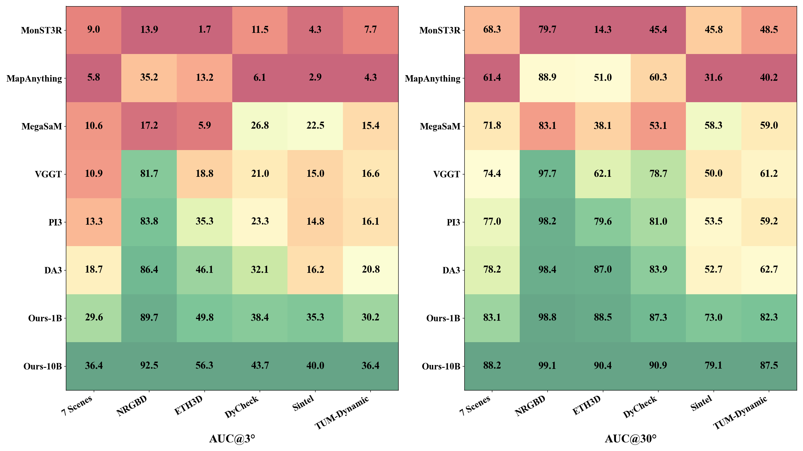
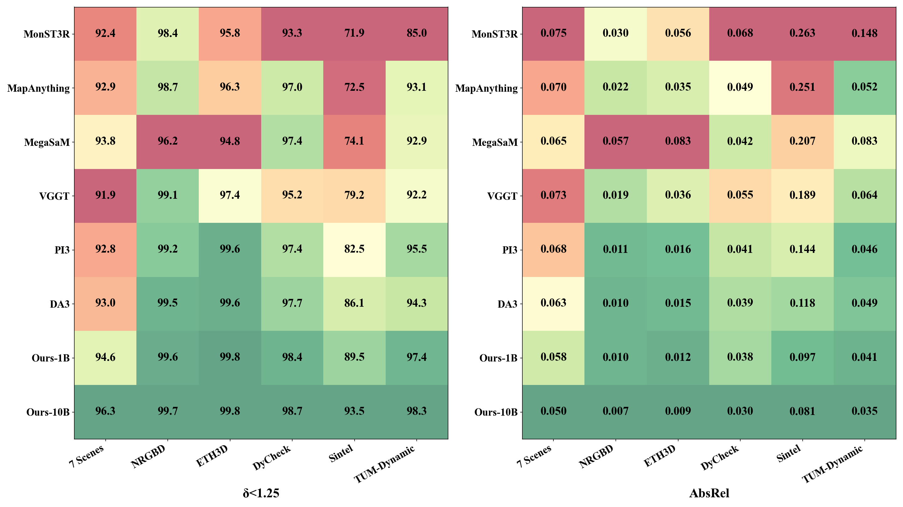
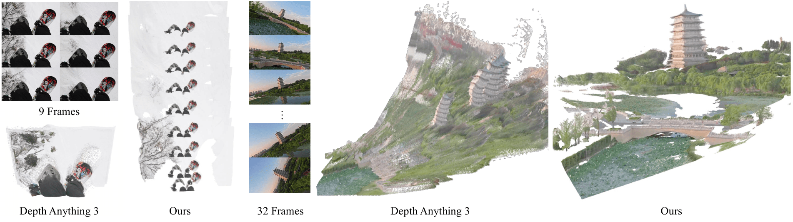
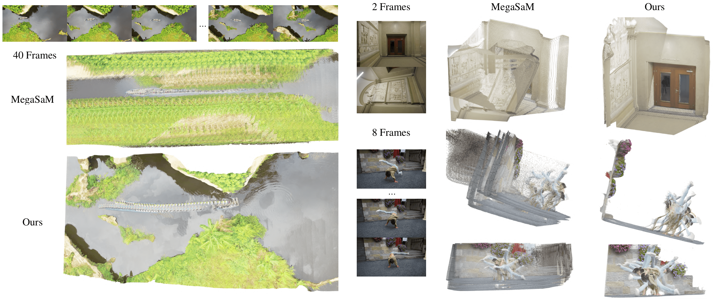
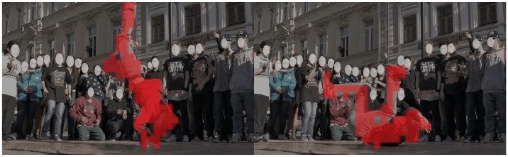
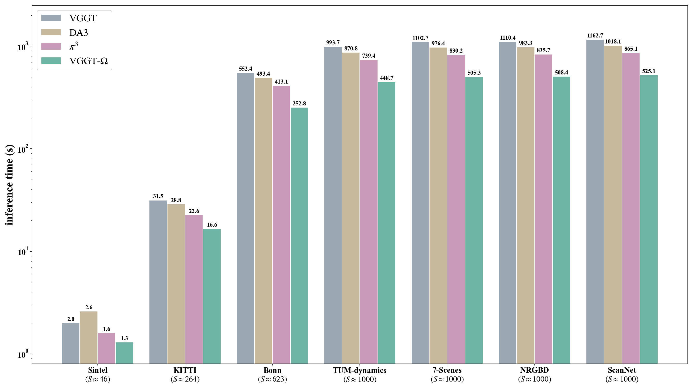
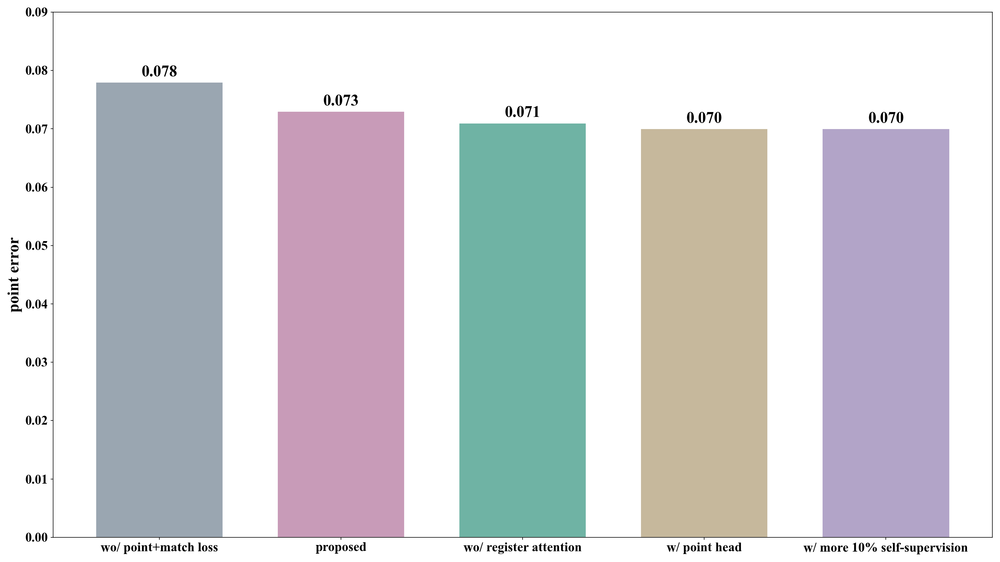

# Caption

<!-- TODO: state = well-constructed all-done verified completed -->

<!--
NOTE:
figure 與 caption 規則
- caption.md 是 master 主文 embed 是 snapshot
- caption 文字以 caption.md 為準 改動先改 caption.md 再 sync 主文
- 下屬 embed 時不擅自修 caption 措辭 有意見回 caption.md DM
- .png -> copy "" and paste
- .md -> read file and paste "\`\`\`text ...\`\`\`"
-->

Figure 1. VGGT-Omega architecture flow.

[Figure 1](f1.md)

Figure 2. Distribution of layer-$13$ global-attention weights in VGGT.

[Figure 2](f2.md)

Figure 3. Inference benchmark protocol.

[Figure 3](f3.md)

Figure 4. Camera pose $\text{AUC}@3^\circ$ and $\text{AUC}@30^\circ$ across six benchmarks for eight methods.

Figure 5. Depth $\delta_{1.25}$ and $\text{AbsRel}$ across six benchmarks for eight methods.

Figure 6. VGGT-Omega against Depth Anything 3 on the snow-lift and drone sequences.

Figure 7. VGGT-Omega against MegaSaM on aerial, indoor, and dynamic sequences.

Figure 8. $k$-means clusters of PCA-reduced intermediate tokens on a dance sequence.

Figure 9. Inference time across seven benchmarks for four methods on an H20 $(96\text{GB})$ GPU.

Figure 10. Inference memory and runtime on an A100 $(80\text{GB})$ GPU.

[Figure 10](f10.md)

Figure 11. Point error against model size from $0.2\text{B}$ to $10\text{B}$ parameters.

[Figure 11](f11.md)

Figure 12. Point error against number of training sequences from $2\text{K}$ to $2\text{M}$.

[Figure 12](f12.md)

Figure 13. Point error of the $1\text{B}$ model across four ablation groups.

Figure 14. Three-stage training schedule with self-supervised teacher loop.

[Figure 14](f14.md)

Figure 15. Video annotation pipeline.

[Figure 15](f15.md)

Figure 16. Three annotation failure modes from sensor capture, synthetic thin structures, and bundle adjustment.

