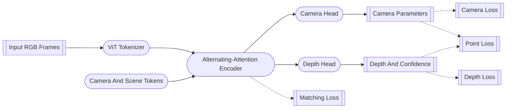

```mermaid
graph LR

In[[Input RGB Frames]]
Embed([ViT Tokenizer])
Append([Camera And Scene Tokens])
Aggregator([Alternating-Attention Encoder])
CamHead([Camera Head])
DepHead([Depth Head])
CamLoss[[Camera Loss]]
DepLoss[[Depth Loss]]
PtLoss[[Point Loss]]
MtLoss[[Matching Loss]]
CamOut[[Camera Parameters]]
DepOut[[Depth And Confidence]]

In --> Embed
Embed --> Aggregator
Append --> Aggregator
Aggregator --> CamHead
Aggregator --> DepHead
CamHead --> CamOut
DepHead --> DepOut
CamOut -.-> CamLoss
DepOut -.-> DepLoss
CamOut -.-> PtLoss
DepOut -.-> PtLoss
Aggregator -.-> MtLoss
```
