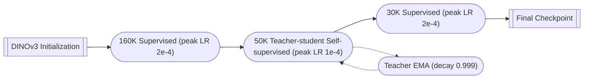

```mermaid
graph LR

Init[["DINOv3 Initialization"]]
Sup1(["160K Supervised (peak LR 2e-4)"])
Self(["50K Teacher-student Self-supervised (peak LR 1e-4)"])
Sup2(["30K Supervised (peak LR 2e-4)"])
Teacher(["Teacher EMA (decay 0.999)"])
Final[["Final Checkpoint"]]

Init --> Sup1
Sup1 --> Self
Self --> Sup2
Sup2 --> Final
Self -.-> Teacher
Teacher -.-> Self
```
