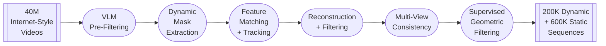

```mermaid
graph LR

Raw[[40M<br/>Internet-Style<br/>Videos]]
VLM([VLM<br/>Pre-Filtering])
DynMask([Dynamic<br/>Mask<br/>Extraction])
Match([Feature<br/>Matching<br/>+ Tracking])
Recon([Reconstruction<br/>+ Filtering])
MVC([Multi-View<br/>Consistency])
GeoFilter([Supervised<br/>Geometric<br/>Filtering])
Out[[200K Dynamic<br/>+ 600K Static<br/>Sequences]]

Raw --> VLM
VLM --> DynMask
DynMask --> Match
Match --> Recon
Recon --> MVC
MVC --> GeoFilter
GeoFilter --> Out
```
