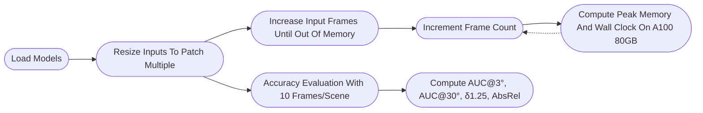

```mermaid
graph LR

LoadModel([Load Models])
Resize([Resize Inputs To Patch Multiple])
EvalMode([Accuracy Evaluation With 10 Frames/Scene])
ResourceMode([Increase Input Frames Until Out Of Memory])
IncrementFrames([Increment Frame Count])
ComputeAccuracy([Compute AUC@3°, AUC@30°, δ1.25, AbsRel])
ComputeResource([Compute Peak Memory And Wall Clock On A100 80GB])

LoadModel --> Resize
Resize --> EvalMode
Resize --> ResourceMode
EvalMode --> ComputeAccuracy
ResourceMode --> IncrementFrames
IncrementFrames --> ComputeResource
ComputeResource -.-> IncrementFrames
```
