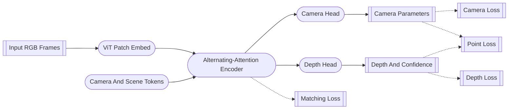
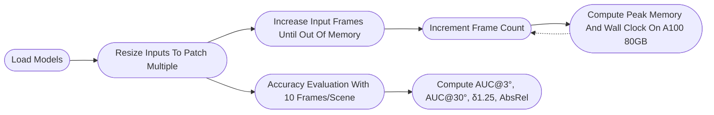

# VGGT-Omega: Detailed technical report (A1)

## Summary

VGGT-Omega is a scalable feed-forward reconstruction model that extends [VGGT](#ref-vggt) to dynamic scenes. The paper investigates whether feed-forward reconstruction scales predictably with model and data size, and finds empirically that it does.

### Contributions

- Empirical demonstration that feed-forward reconstruction follows power-law-like scaling with model and data size.
- Register attention restricts a fraction of inter-frame attention layers to camera and register tokens, cutting compute without measurable accuracy loss.
- A high-quality annotation pipeline produces camera and depth labels for off-the-shelf dynamic videos at scale.
- A single dense prediction head with multi-task losses replaces the multi-head decoder of [VGGT](#ref-vggt), supervising depth, point map, and matching from one head.

## Method

VGGT-Omega is a feed-forward function $f$ that maps $S$ input images to a per-frame camera and depth. The camera vector is $\mathbf{g}_i = (\mathbf{q}_i, \mathbf{t}_i, \mathbf{f}_i) \in \mathbb{R}^9$ with $\mathbf{q}_i \in \mathbb{R}^4$ a rotation quaternion, $\mathbf{t}_i \in \mathbb{R}^3$ a translation, and $\mathbf{f}_i \in \mathbb{R}^2$ a field of view; the depth is $D_i$ of shape $(H, W)$. The principal point is assumed at the image center. [[Code: Predict cameras and depths, Example]](#code-review-example-predict-cameras-and-depths)

Point maps and tracks are not predicted directly: they are supervised only through training losses. The camera output feeds the camera and point losses, the depth output feeds the depth and point losses, and the aggregator last-layer tokens feed the matching loss.

<span id="figure-1">Figure 1.</span> VGGT-Omega architecture flow.



### Backbone Tokenization

A vision transformer initialized from DINOv3 tokenizes each frame into patch tokens that the inter-frame aggregator consumes. [[Code: Default configuration, Tokenizer]](#code-review-tokenizer-default-configuration) [[Code: Patch-token features, Tokenizer]](#code-review-tokenizer-patch-token-features)

### Inter-frame Aggregation

Each frame carries one camera token that supervises the camera head and a set of register tokens, also called scene tokens, that aggregate global information. Reference and non-reference frames use separate learnable parameters for these tokens. Together with the patch tokens from the backbone, each frame contributes $T$ tokens to the inter-frame aggregator. [[Code: Camera and register tokens, Aggregator]](#code-review-aggregator-camera-and-register-tokens)

The encoder interleaves frame-wise attention within each frame with inter-frame attention across all frames. Frame-wise attention applies RoPE while inter-frame attention does not. The full inter-frame attention is quadratic in the total token count $S \times T$. [[Code: Alternating attention, Aggregator]](#code-review-aggregator-alternating-attention) [[Code: Frame attention, Aggregator]](#code-review-aggregator-frame-attention)

Global attention maps are sparse:

<span id="figure-2">Figure 2.</span> Distribution of layer-$13$ global-attention weights in VGGT.

```text
Count
      11106     24        17        3         2        1
10000│█
 1000│███
  100│██████
   10│█████████████████   ██
    1│███████████████████████████████ ██████ ██  █ ██  █
     └──────────────────────────────────────────────────
      0.00      0.05      0.10      0.15      0.20  0.25
                       attention value
```

A fraction of inter-frame layers therefore restrict attention to the camera and register tokens only, leaving image tokens out of that step. The updated registers redistribute global information back to image tokens through the next frame-wise attention. About $25\%$ of the inter-frame layers use this restricted form. A subset of encoder layers is also cached, concatenating frame-wise outputs with global outputs along the channel axis, and the cached features feed both decoding heads. [[Code: Global or register attention, Aggregator]](#code-review-aggregator-global-or-register-attention) [[Code: Default configuration, Aggregator]](#code-review-aggregator-default-configuration)

### Dense Prediction Head

The dense prediction head fuses the cached aggregator layers in the DPT style: each cached layer is projected to a convolutional feature map at its scale, and refinenet blocks fuse the per-scale maps into a single map. [[Code: Default configuration, Dense head]](#code-review-dense-head-default-configuration) [[Code: Multi-scale projection, Dense head]](#code-review-dense-head-multi-scale-projection) [[Code: DPT feature fusion, Dense head]](#code-review-dense-head-dpt-feature-fusion)

Above $1/4$ of the input resolution the high-resolution DPT conv is replaced by an MLP followed by pixel-shuffle, because the replaced conv layers carry most of the per-step activation memory. The early low-resolution DPT conv is retained. The head outputs per-pixel depth and confidence. [[Code: Depth and confidence prediction, Dense head]](#code-review-dense-head-depth-and-confidence-prediction)

### Camera Head and Pose Recovery

The camera head reads the camera and register tokens sliced from the cached aggregator features. It runs a single forward pass without iterative refinement: a transformer trunk followed by an MLP regresses the 9-dimensional camera vector. [[Code: Default configuration, Camera head]](#code-review-camera-head-default-configuration) [[Code: Special token transformer trunk, Camera head]](#code-review-camera-head-special-token-transformer-trunk) [[Code: Camera parameter regression, Camera head]](#code-review-camera-head-camera-parameter-regression)

The predicted 9-dimensional vector recovers extrinsics in W2C through quaternion-to-matrix conversion and intrinsics through field-of-view-to-focal conversion. [[Code: Pose encoding to camera, Camera head]](#code-review-camera-head-pose-encoding-to-camera)

### Dynamic Reconstruction

VGGT-Omega predicts depth and camera only. Point maps would require segmenting moving pixels, ray maps add an expensive dense output and entangle camera with appearance, and an explicit motion-mask output adds another head without a clear benefit. The motion prior is learned from data.

## Evaluation

### Variants

VGGT-Omega is released as four trained variants: 200M, 500M, 1B, and 10B parameters, with 12, 12, 24, and 16 alternating-attention layers, and embed dimensions 384, 768, 1024, and 4096 respectively.

### Benchmarking

VGGT-Omega is benchmarked against feed-forward baselines ([DA3](#ref-da3), [Pi3](#ref-pi3), [VGGT](#ref-vggt), MapAnything, MonST3R) and the optimization-based dynamic method [MegaSaM](#ref-megasam). The benchmark covers three static datasets (7 Scenes, NRGBD, ETH3D) and three dynamic datasets (DyCheck, Sintel, TUM-Dynamic), sampling 10 random frames per scene. Camera pose accuracy uses AUC@3° and AUC@30°; depth accuracy uses $\delta_{1.25}$ and AbsRel.

Feed-forward baselines lead on static scenes, [MegaSaM](#ref-megasam) holds dynamic at strict thresholds, and VGGT-Omega leads both regimes.

<span id="figure-4">Figure 4.</span> Camera pose $\text{AUC}@3^\circ$ and $\text{AUC}@30^\circ$ across six benchmarks for eight methods.


VGGT-Omega lowers AbsRel even on benchmarks where prior methods already saturated, with the largest margin on dynamic scenes.

<span id="figure-5">Figure 5.</span> Depth $\delta_{1.25}$ and $\text{AbsRel}$ across six benchmarks for eight methods.


[DA3](#ref-da3) struggles with repeated textures and strong camera roll, where VGGT-Omega remains stable.

<span id="figure-6">Figure 6.</span> VGGT-Omega against Depth Anything 3 on the snow-lift and drone sequences.


[MegaSaM](#ref-megasam) breaks down on sparse indoor walls and aerial sequences with substantial roll, while VGGT-Omega stays consistent.

<span id="figure-7">Figure 7.</span> VGGT-Omega against MegaSaM on aerial, indoor, and dynamic sequences.


### Inference Cost

Inference is measured with PyTorch SDPA on a flash-attention v2 backend, at resolutions matched to each model's patch size. Two tracks run in parallel: an accuracy track at 10 frames per scene, and a resource track that grows the frame count until OOM on an A100 80GB.

<span id="figure-3">Figure 3.</span> Inference benchmark protocol.



The original [VGGT](#ref-vggt) implementation caches intermediate tensors from every layer at inference, although the heads only read from a few of them. Caching just those layers substantially reduces inference memory, and the corrected setup is what is measured here.

As reported by [Spark3R](#ref-spark3r), the H20 sweep extends the comparison to KITTI, Bonn, and ScanNet, where the gap to [DA3](#ref-da3) widens with sequence length.

<span id="figure-9">Figure 9.</span> Inference time across seven benchmarks for four methods on an H20 $(96\text{GB})$ GPU.


[VGGT](#ref-vggt) and VGGT-Omega hit OOM at roughly the same frame count, well beyond [DA3](#ref-da3).

<span id="figure-10">Figure 10.</span> Inference memory and runtime on an A100 $(80\text{GB})$ GPU.

```text
  Variant
Ω-all-reg │█                           11.7
Ω-default │███████████████████████████ 240.2
          └────────────────────────────
          0                          250
             runtime (s)

   Method
      DA3 │████████████████            750
     VGGT │███████████████████████████ 1250
        Ω │███████████████████████████ 1250
          └────────────────────────────
          0                         1500
             input frames at OOM
```

An all-register variant trades reconstruction accuracy for an order-of-magnitude runtime gain at nearly unchanged peak memory.

### Ablation Studies

Ablations use the 1B variant trained on 2M sequences with 64 GPUs for 150K supervised steps. Performance is reported as point error, the $\ell_2$ distance between unprojected predicted points and the ground-truth point map, computed under approximately equal training tokens per run.

Scaling the model improves performance monotonically, consistent with the power-law conjecture.

<span id="figure-11">Figure 11.</span> Point error against model size from $0.2\text{B}$ to $10\text{B}$ parameters.

```text
Model
 0.2B │███████████████████████  0.107
   1B │████████████████         0.073
   5B │████████████             0.057
  10B │██████████               0.046
      └───────────────────────────
      0                         0.12
         point error
```

Scaling the training data follows the same shape across three decades.

<span id="figure-12">Figure 12.</span> Point error against number of training sequences from $2\text{K}$ to $2\text{M}$.

```text
 Data
   2K │██████████████████████ 0.275
  10K │█████████████████      0.210
 100K │█████████████          0.160
 200K │██████████             0.129
2000K │██████                 0.073
      └─────────────────────────
       0                      0.30
          point error
```

Register attention matches full global attention, dropping the point or matching losses worsens the error, a [VGGT](#ref-vggt)-style multi-head head ties the baseline at the cost of scalability, and a small self-supervised share matches that tie.

<span id="figure-13">Figure 13.</span> Point error of the $1\text{B}$ model across four ablation groups.


On the Sintel sequences and pixels that pass both filters, the annotation pipeline produces camera and depth ground truth substantially more accurate than [MegaSaM](#ref-megasam).

### Motion Awareness

Clustering the PCA-reduced intermediate tokens with k-means, without any motion label, optical flow, or learned probe, reveals a cluster that consistently tracks the moving subject across frames. Early layers isolate motion most cleanly, middle layers retain a weaker signal, and the deepest layers become semantic and highlight every person in the scene. Motion discrimination thus emerges as a byproduct of the reconstruction objective even though the model is never given the temporal frame order:

<span id="figure-8">Figure 8.</span> $k$-means clusters of PCA-reduced intermediate tokens on a dance sequence.


## Limitations

- Strong motion blur degrades reconstruction.
- Abrupt field-of-view changes destabilize camera estimation.
- Heavily distorted cameras remain unhandled.
- Early-phase noisy training data leaves unstable predictions on similar scenes such as ScanNet++ office sequences with many monitors.
- Privacy and license masks on faces and trademarks in the training data leave depth artifacts on similar regions such as black clothing.
- MLP-only dense heads produce patch artifacts in outdoor distant regions.
- Replacing all global layers with register attention cuts FLOPs heavily but accuracy regresses to the original [VGGT](#ref-vggt) level.
- Online prediction normalization improves qualitative spread but risks gradient explosion without pretrained initialization.
- Auxiliary inputs during pretraining are detrimental and only help in fine-tuning.
- Self-supervised reconstruction remains an open problem: only the teacher-student protocol helped and it still requires a pretrained checkpoint.

## References

<a id="ref-vggt-omega"></a>
**[VGGT-Omega.](https://alphaxiv.org/abs/2605.15195)**
Jianyuan Wang, Minghao Chen, Shangzhan Zhang, Nikita Karaev, Johannes Schönberger, Patrick Labatut, Piotr Bojanowski, David Novotny, Andrea Vedaldi, Christian Rupprecht.
arXiv:2605.15195, 2026.

<a id="ref-spark3r"></a>
**[Spark3R: Asymmetric Token Reduction Makes Fast Feed-Forward 3D Reconstruction.](https://alphaxiv.org/abs/2605.06270)**
Zecheng Tang, Jiaye Fu, Qiankun Gao, Haijie Li, Yanmin Wu, Jiaqi Zhang, Siwei Ma, Jian Zhang.
arXiv:2605.06270, 2026.

<a id="ref-vggt"></a>
**[VGGT: Visual Geometry Grounded Transformer.](https://alphaxiv.org/abs/2503.11651)**
Jianyuan Wang, Minghao Chen, Nikita Karaev, Andrea Vedaldi, Christian Rupprecht, David Novotny.
arXiv:2503.11651, 2025.

<a id="ref-pi3"></a>
**[Pi3: Permutation-Equivariant Visual Geometry Learning.](https://alphaxiv.org/abs/2507.13347)**
Yifan Wang, Jianjun Zhou, Haoyi Zhu, Wenzheng Chang, Yang Zhou, Zizun Li, Junyi Chen, Jiangmiao Pang, Chunhua Shen, Tong He.
arXiv:2507.13347, 2026.

<a id="ref-da3"></a>
**[Depth Anything 3: Recovering the Visual Space from Any Views.](https://alphaxiv.org/abs/2511.10647)**
Haotong Lin, Sili Chen, Junhao Liew, Donny Y. Chen, Zhenyu Li, Guang Shi, Jiashi Feng, Bingyi Kang.
arXiv:2511.10647, 2025.

<a id="ref-megasam"></a>
**[MegaSaM: Accurate, Fast, and Robust Structure and Motion from Casual Dynamic Videos.](https://alphaxiv.org/abs/2412.04463)**
Zhengqi Li, Richard Tucker, Forrester Cole, Qianqian Wang, Linyi Jin, Vickie Ye, Angjoo Kanazawa, Aleksander Holynski, Noah Snavely.
arXiv:2412.04463, 2024.

## Code Review

### Code Review: Example

A minimum viable example of inference taking a test scene of WildRGB-D dataset.

Run:

```bash
uv run --extra example examples/wildrgbd/mve.py
```

<details id="code-review-example-load-the-model-and-images">
<summary><a href="../examples/wildrgbd/mve.py#L6-L44">
Load the model and images
</a></summary>

```python
from pathlib import Path
# ...
from vggt_omega.models import VGGTOmega
from vggt_omega.utils import load_fn, pose_enc
from torch import Tensor
import torch


def main():
    # Load the model
    model = VGGTOmega()
    model.load_state_dict(
        torch.load(
            "/home/3dv_25/shared/hdd_vg/projects/facebook/VGGT-Omega/vggt_omega_1b_512.pt"
        )
    )
    model = model.to("cuda")

    # Load the image
    # (B, S, 3, H, W) in [0, 1]
    image = (
        load_fn.load_and_preprocess_images(
            sorted(
                Path(
                    "/home/3dv_25/shared/hdd_vg/datasets/wildrgb_d/TV/scenes/scene_000/rgb"
                ).glob("*.png")
            )
        )[::32]
        .unsqueeze(0)
        .to("cuda")
    )
```

</details>

<details id="code-review-example-predict-cameras-and-depths">
<summary><a href="../examples/wildrgbd/mve.py#L47-L57">
Predict cameras and depths
</a></summary>

```python
    # Switch to evaluation mode
    model = model.eval().requires_grad_(False)
    with torch.inference_mode():
        # Run model inference
        with torch.autocast("cuda", dtype=torch.bfloat16):
            token, index = model.aggregator(image)
            # [(B, S, H, W, 1) in exp, (B, S, H, W, 1) in exp+1]
            y: tuple[Tensor, Tensor] = model.dense_head(token, *image.shape[-2:], index)
            depth, depth_conf = y
            # (B, S, 9)
            pose: Tensor = model.camera_head(token, index)
```

</details>

<details id="code-review-example-build-point-cloud">
<summary><a href="../examples/wildrgbd/mve.py#L62-L69">
Build point cloud
</a></summary>

```python
        # Build point cloud from depth and camera pose
        # [(B, S, 3, 4) in W2C, (B, S, 3, 3)]
        pose_extr, pose_intr = pose_enc.encoding_to_camera(pose, image.shape[-2:])
        # [(B, N, 3), (B, N, 3)]
        pcd = Pointclouds(
            points=unproject(depth, pose_extr, pose_intr).flatten(-4, -2),
            features=image.movedim(-3, -1).contiguous().flatten(-4, -2),
        )

# ...

def unproject(depth: Tensor, extr: Tensor, intr: Tensor) -> Tensor:
    """
    Unproject camera pose and depth to point in world coordinate.

    Formula:
        Y = R^t @ K^-1 @ [u, v, 1]^t
        C = -R^t @ T
        P = D * Y + C

    Shape:
        [(..., H, W, 1), (..., 3, 4) in W2C, (..., 3, 3)] -> (..., H, W, 3) in world
    """
    # ...
```

</details>

<details id="code-review-example-render-frames-and-export-video">
<summary><a href="../examples/wildrgbd/mve.py#L71-L92">
Render frames and export video
</a></summary>

```python
        # Interpolate camera poses
        # (B, S_seq, 9)
        pose_seq = interpolate_pose(pose, step=16)

        # Render point cloud
        # (B, S_seq, 3, H, W) in [0, 255]
        image_seq = (
            rasterize_pcd(
                pcd=pcd,
                pose=pose_seq,
                frame_size=image.shape[-2:],
            )
            .clamp(0.0, 1.0)
            .mul(255.0)
            .to(torch.uint8)
        )

        # Save the rendered frames as a video
        VideoEncoder(image_seq[0].cpu(), frame_rate=30.0).to_file(
            Path(__file__).with_suffix(".mp4"),
            codec="h264",
        )
```

</details>

### Code Review: Tokenizer

<details id="code-review-tokenizer-default-configuration">
<summary><a href="../vggt_omega/models/layers/vision_transformer.py#L66-L99">
Default configuration
</a></summary>

```python
class DinoVisionTransformer(nn.Module):
    def __init__(
        self,
        *,
        # Nominal size; the patch grid follows the actual input resolution.
        img_size: int = 224,
        # 16-pixel patches, matching the aggregator.
        patch_size: int = 16,
        # RGB input.
        in_chans: int = 3,
        # Rotary position embedding over the patch grid, inherited from DINOv3.
        pos_embed_rope_base: float = 100.0,
        # Optional RoPE coordinate normalization and perturbations; unused here.
        pos_embed_rope_min_period: float | None = None,
        pos_embed_rope_max_period: float | None = None,
        pos_embed_rope_normalize_coords: Literal["min", "max", "separate"] = "separate",
        pos_embed_rope_shift_coords: float | None = None,
        pos_embed_rope_jitter_coords: float | None = None,
        pos_embed_rope_rescale_coords: float | None = None,
        pos_embed_rope_dtype: str = "bf16",
        # Backbone width, depth, and heads; VGGT-Omega-1B uses the ViT-L/16 preset (1024, 24, 16).
        embed_dim: int = 768,
        depth: int = 12,
        num_heads: int = 12,
        # FFN hidden width is ffn_ratio times the embedding.
        ffn_ratio: float = 4.0,
        # Biases on the QKV, output projection, and FFN.
        qkv_bias: bool = True,
        # Stochastic depth rate (0 disables it).
        drop_path_rate: float = 0.0,
        # LayerScale init value; None falls back to identity.
        layerscale_init: float | None = None,
        # Norm and FFN variants selected by name (LayerNorm and MLP here).
        norm_layer: str = "layernorm",
        ffn_layer: str = "mlp",
        ffn_bias: bool = True,
        proj_bias: bool = True,
        # DINOv3 register tokens, separate from the aggregator's scene tokens (4 in VGGT-Omega).
        n_storage_tokens: int = 0,
        # Mask the key bias, as the released aggregator was trained.
        mask_k_bias: bool = False,
        # Separate CLS/patch norms; left off in VGGT-Omega.
        untie_cls_and_patch_norms: bool = False,
        untie_global_and_local_cls_norm: bool = False,
        device: Any | None = None,
        **ignored_kwargs,
    ):
```

</details>

<details id="code-review-tokenizer-patch-embedding">
<summary><a href="../vggt_omega/models/layers/patch_embed.py#L70-L83">
Patch embedding
</a></summary>

```python
    def forward(self, x: Tensor) -> Tensor:
        # Patchify each image into a flat sequence of patch tokens.
        # (B * S, 3, H, W) -> (B * S, C, H_p, W_p)
        x = self.proj(x)
        H, W = x.size(2), x.size(3)
        # (B * S, T_p, C)
        x = x.flatten(2).transpose(1, 2)
        x = self.norm(x)
        if not self.flatten_embedding:
            # (B * S, H_p, W_p, C)
            x = x.reshape(-1, H, W, self.embed_dim)
        return x
```

</details>

<details id="code-review-tokenizer-patch-token-features">
<summary><a href="../vggt_omega/models/layers/vision_transformer.py#L229-L269">
Patch-token features
</a></summary>

```python
    def forward_features_list(self, x_list: List[Tensor], masks_list: List[Tensor]) -> List[Dict[str, Tensor]]:
        # Run the DINOv3 backbone and keep only the patch tokens for the aggregator.
        x = []
        rope = []
        for t_x, t_masks in zip(x_list, masks_list):
            # Prepend 1 class token and 4 DINOv3 storage tokens.
            # (B * S, 3, H, W) -> (B * S, 1 + 4 + T_p, C)
            t2_x, hw_tuple = self.prepare_tokens_with_masks(t_x, t_masks)
            x.append(t2_x)
            rope.append(hw_tuple)
        for _, blk in enumerate(self.blocks):
            rope_sincos = [self.rope_embed(H=H, W=W) for H, W in rope]
            # ...
            x = checkpoint(blk, x, rope_sincos, use_reentrant=False)
        all_x = x
        output = []
        for idx, (x, masks) in enumerate(zip(all_x, masks_list)):
            x_norm = self.norm(x)
            # (B * S, T_p, C)
            x_norm_patch = x_norm[:, self.n_storage_tokens + 1 :]
            # ...
            output.append(
                {
                    "x_norm_patchtokens": x_norm_patch,
                    # ...
                }
            )
        return output
```

</details>

### Code Review: Aggregator

<details id="code-review-aggregator-default-configuration">
<summary><a href="../vggt_omega/models/aggregator.py#L19-L33">
Default configuration
</a></summary>

```python
class Aggregator(nn.Module):
    """Alternating-attention encoder over video frames."""

    def __init__(
        self,
        # DINOv3-compatible ViT-L/16.
        patch_size: int = 16,
        embed_dim: int = 1024,
        # 24 transformer layers, each is composed of
        # one frame attention block and one global attention block.
        depth: int = 24,
        # Multi-head self-attention with 16 heads, so head dimension is 64 (1024 / 16).
        num_heads: int = 16,
        # FFN hidden width is mlp_ratio times the embedding.
        mlp_ratio: float = 4.0,
        # Register tokens are always shared across all frames,
        # but the number of camera token is always 1.
        num_register_tokens: int = 16,
        # Inter-frame blocks at these indices run register attention instead of global (about 25% of layers).
        register_attention_block_indices: list[int] = [2, 6, 9, 14, 20],
        # Only these four layers are cached, since the heads read just those.
        cached_layer_indices: tuple[int, ...] = (4, 11, 17, 23),
    ) -> None:
```

</details>

<details id="code-review-aggregator-camera-and-register-tokens">
<summary><a href="../vggt_omega/models/aggregator.py#L251-L256">
Camera and register tokens
</a></summary>

```python
def slice_expand_and_flatten(token_tensor: torch.Tensor, batch_size: int, num_frames: int) -> torch.Tensor:
    # Expand the reference/other token pair across frames; the first frame is the reference.
    # (1, 2, T_c, C)
    first_frame_token = token_tensor[:, 0:1].expand(batch_size, 1, *token_tensor.shape[2:])
    other_frame_tokens = token_tensor[:, 1:].expand(batch_size, num_frames - 1, *token_tensor.shape[2:])
    # (B, S, T_c, C)
    tokens = torch.cat([first_frame_token, other_frame_tokens], dim=1)
    # (B * S, T_c, C)
    return tokens.view(batch_size * num_frames, *tokens.shape[2:])
```

</details>

<details id="code-review-aggregator-alternating-attention">
<summary><a href="../vggt_omega/models/aggregator.py#L101-L160">
Alternating attention
</a></summary>

```python
    def forward(
        self,
        images: torch.Tensor,
    ) -> tuple[list[torch.Tensor | None], int]:
        # Encode all frames with alternating frame-wise and global (or register) attention, caching selected layers.
        batch_size, num_frames, num_channels, height, width = images.shape
        if num_channels != 3:
            raise ValueError(f"Expected 3 input channels, got {num_channels}")

        images = (images - self._resnet_mean) / self._resnet_std
        # (B, S, 3, H, W) -> (B * S, 3, H, W)
        images = images.view(batch_size * num_frames, num_channels, height, width)

        # (B * S, T_c, C)
        camera_token = slice_expand_and_flatten(self.camera_token, batch_size, num_frames)
        # (B * S, T_r, C)
        register_token = slice_expand_and_flatten(self.register_token, batch_size, num_frames)

        # (B * S, T_p, C)
        patch_tokens = self.patch_embed(images)
        if isinstance(patch_tokens, dict):
            patch_tokens = patch_tokens["x_norm_patchtokens"]

        # (B * S, T, C)
        tokens = torch.cat([camera_token, register_token, patch_tokens], dim=1)
        _, num_tokens, embed_dim = tokens.shape

        patch_grid_size = (height // self.patch_size, width // self.patch_size)
        with torch.no_grad():
            rope_sin, rope_cos = self.rope_embed(H=patch_grid_size[0], W=patch_grid_size[1])
            frame_rope = (
                rope_sin.to(device=patch_tokens.device, dtype=torch.float32),
                rope_cos.to(device=patch_tokens.device, dtype=torch.float32),
            )

        outputs = []
        for block_idx in range(self.depth):
            tokens, frame_tokens = checkpoint(
                self._run_frame_block,
                tokens,
                batch_size,
                num_frames,
                num_tokens,
                embed_dim,
                block_idx,
                frame_rope,
                use_reentrant=False,
            )
            tokens = checkpoint(
                self._run_inter_frame_attention_block,
                tokens,
                batch_size,
                num_frames,
                num_tokens,
                embed_dim,
                block_idx,
                self.inter_frame_attention_types[block_idx],
                use_reentrant=False,
            )
            if block_idx in self.cached_layer_indices:
                # (B, S, T, 2 * C)
                outputs.append(torch.cat([frame_tokens, tokens], dim=-1))
            else:
                outputs.append(None)

        return outputs, self.patch_token_start
```

</details>

<details id="code-review-aggregator-frame-attention">
<summary><a href="../vggt_omega/models/aggregator.py#L161-L174">
Frame attention
</a></summary>

```python
    def _run_frame_block(
        self,
        tokens: torch.Tensor,
        batch_size: int,
        num_frames: int,
        num_tokens: int,
        embed_dim: int,
        block_idx: int,
        rope_sincos: tuple[torch.Tensor, torch.Tensor],
    ) -> tuple[torch.Tensor, torch.Tensor]:
        # Apply frame-wise self-attention independently within each frame.
        # (B, S, T, C) -> (B * S, T, C)
        tokens = tokens.view(batch_size * num_frames, num_tokens, embed_dim)
        tokens = self.frame_blocks[block_idx](tokens, rope_sincos)
        # [(B * S, T, C), (B, S, T, C)]
        return tokens, tokens.view(batch_size, num_frames, num_tokens, embed_dim)
```

</details>

<details id="code-review-aggregator-global-or-register-attention">
<summary><a href="../vggt_omega/models/aggregator.py#L175-L223">
Global or register attention
</a></summary>

```python
    def _run_inter_frame_attention_block(
        self,
        tokens: torch.Tensor,
        batch_size: int,
        num_frames: int,
        num_tokens: int,
        embed_dim: int,
        block_idx: int,
        attention_type: str,
    ) -> torch.Tensor:
        # Inter-frame attention: full global attention, or register attention over camera and register tokens only.
        # (B * S, T, C) -> (B, S, T, C)
        tokens = tokens.view(batch_size, num_frames, num_tokens, embed_dim)

        if attention_type == "global":
            # (B, S * T, C)
            tokens = tokens.view(batch_size, num_frames * num_tokens, embed_dim)
            tokens = self.inter_frame_blocks[block_idx](tokens, None)
            # (B, S, T, C)
            return tokens.view(batch_size, num_frames, num_tokens, embed_dim)

        if attention_type != "register":
            raise ValueError(f"Unknown inter-frame attention type: {attention_type}")

        patch_token_start = self.patch_token_start
        # (B, S * (T_c + T_r), C)
        camera_and_register_tokens = tokens[:, :, :patch_token_start].reshape(
            batch_size,
            num_frames * patch_token_start,
            embed_dim,
        )
        # (B, S * T_p, C)
        patch_tokens = tokens[:, :, patch_token_start:].reshape(
            batch_size,
            num_frames * (num_tokens - patch_token_start),
            embed_dim,
        )

        camera_and_register_tokens = self.inter_frame_blocks[block_idx](camera_and_register_tokens, None)
        tokens = torch.cat([camera_and_register_tokens, patch_tokens], dim=1)

        # (B, S, T_c + T_r, C)
        camera_and_register_tokens = tokens[:, : num_frames * patch_token_start].view(
            batch_size,
            num_frames,
            patch_token_start,
            embed_dim,
        )
        # (B, S, T_p, C)
        patch_tokens = tokens[:, num_frames * patch_token_start :].view(
            batch_size,
            num_frames,
            num_tokens - patch_token_start,
            embed_dim,
        )
        # (B, S, T, C)
        return torch.cat([camera_and_register_tokens, patch_tokens], dim=2)
```

</details>

<details id="code-review-aggregator-transformer-block">
<summary><a href="../vggt_omega/models/layers/block.py#L22-L74">
Transformer block
</a></summary>

```python
class SelfAttentionBlock(nn.Module):
    def __init__(
        self,
        dim: int,
        num_heads: int,
        ffn_ratio: float = 4.0,
        qkv_bias: bool = False,
        proj_bias: bool = True,
        ffn_bias: bool = True,
        drop: float = 0.0,
        attn_drop: float = 0.0,
        init_values=None,
        drop_path: float = 0.0,
        act_layer: Callable[..., nn.Module] = nn.GELU,
        norm_layer: Callable[..., nn.Module] = nn.LayerNorm,
        attn_class: Callable[..., nn.Module] = SelfAttention,
        ffn_layer: Callable[..., nn.Module] = Mlp,
        mask_k_bias: bool = False,
        use_qk_norm: bool = False,
        device=None,
    ) -> None:
        super().__init__()
        # ...
        self.norm1 = norm_layer(dim)
        self.attn = attn_class(
            dim,
            num_heads=num_heads,
            qkv_bias=qkv_bias,
            proj_bias=proj_bias,
            attn_drop=attn_drop,
            proj_drop=drop,
            mask_k_bias=mask_k_bias,
            use_qk_norm=use_qk_norm,
            device=device,
        )
        self.ls1 = LayerScale(dim, init_values=init_values, device=device) if init_values else nn.Identity()

        self.norm2 = norm_layer(dim)
        mlp_hidden_dim = int(dim * ffn_ratio)
        self.mlp = ffn_layer(
            in_features=dim,
            hidden_features=mlp_hidden_dim,
            act_layer=act_layer,
            drop=drop,
            bias=ffn_bias,
            device=device,
        )
        self.ls2 = LayerScale(dim, init_values=init_values, device=device) if init_values else nn.Identity()

        self.sample_drop_ratio = drop_path
```

</details>

<details id="code-review-aggregator-self-attention">
<summary><a href="../vggt_omega/models/layers/attention.py#L123-L139">
Self-attention
</a></summary>

```python
    def compute_attention(self, qkv: Tensor, attn_bias=None, rope=None) -> Tensor:
        # Multi-head self-attention shared by frame-wise and global attention.
        assert attn_bias is None
        B, N, _ = qkv.shape
        C = self.qkv.in_features

        # (B, T, 3 * C) -> (B, T, 3, n_h, C // n_h)
        qkv = qkv.reshape(B, N, 3, self.num_heads, C // self.num_heads)
        # [(B, T, n_h, C // n_h); 3]
        q, k, v = torch.unbind(qkv, 2)
        # Move the head axis ahead of the token axis for attention.
        # [(B, n_h, T, C // n_h); 3]
        q, k, v = [t.transpose(1, 2) for t in [q, k, v]]
        # QK normalization stabilizes the attention logits in the aggregator blocks.
        if self.use_qk_norm:
            q = self.q_norm(q)
            k = self.k_norm(k)
        # Rotary position embedding applies within frame-wise attention; global and register attention omit it.
        if rope is not None:
            q, k = self.apply_rope(q, k, rope)
        # (B, n_h, T, C // n_h)
        x = torch.nn.functional.scaled_dot_product_attention(q, k, v)
        # (B, n_h, T, C // n_h) -> (B, T, C)
        x = x.transpose(1, 2)
        return x.reshape([B, N, C])
```

</details>

### Code Review: Dense head

<details id="code-review-dense-head-default-configuration">
<summary><a href="../vggt_omega/models/heads/dense_head.py#L20-L32">
Default configuration
</a></summary>

```python
class DenseHead(nn.Module):
    """Dense prediction head used by the released VGGT-Omega checkpoints."""

    def __init__(
        self,
        # Width of the cached aggregator tokens (frame-wise plus global features), so 2 * C.
        dim_in: int = 2048,
        # 16-pixel patches, matching the backbone.
        patch_size: int = 16,
        # Working width of the DPT fusion.
        features: int = 256,
        # Per-scale DPT projection channels, coarse to fine.
        out_channels: list[int] = [256, 512, 1024, 1024],
        # Aggregator layers cached for the DPT head.
        intermediate_layer_idx: list[int] = [4, 11, 17, 23],
        # Return fused features only, skipping the depth and confidence heads.
        feature_only: bool = False,
    ) -> None:
```

</details>

<details id="code-review-dense-head-multi-scale-projection">
<summary><a href="../vggt_omega/models/heads/dense_head.py#L165-L175">
Multi-scale projection
</a></summary>

```python
    def _run_multi_scale_layer(self, patch_tokens: torch.Tensor, feature_idx: int, height: int, width: int) -> torch.Tensor:
        # Project one cached aggregator layer into a convolutional feature map for the DPT head.
        patch_h, patch_w = height // self.patch_size, width // self.patch_size

        # (B, S, T_p, 2 * C) -> (B * S, T_p, 2 * C)
        patch_tokens = patch_tokens.flatten(0, 1)
        patch_tokens = self.norm(patch_tokens)
        # (B * S, 2 * C, H_p, W_p)
        patch_tokens = patch_tokens.permute(0, 2, 1).contiguous().unflatten(2, (patch_h, patch_w))
        # (B * S, C_k, H_p, W_p)
        patch_tokens = self.projects[feature_idx](patch_tokens)
        patch_tokens = self._apply_pos_embed(patch_tokens, width, height)
        # (B * S, C_k, H_k, W_k)
        patch_tokens = self.resize_layers[feature_idx](patch_tokens)
        return patch_tokens
```

</details>

<details id="code-review-dense-head-dpt-feature-fusion">
<summary><a href="../vggt_omega/models/heads/dense_head.py#L185-L197">
DPT feature fusion
</a></summary>

```python
    def scratch_forward(self, features: list[torch.Tensor]) -> torch.Tensor:
        # Fuse the multi-scale features into a single map through the DPT refinement blocks.
        # [(B * S, C_k, H_k, W_k); 4]
        layer_1, layer_2, layer_3, layer_4 = features

        # [(B * S, C_f, H_k, W_k); 4]
        layer_1_rn = self.scratch.layer1_rn(layer_1)
        layer_2_rn = self.scratch.layer2_rn(layer_2)
        layer_3_rn = self.scratch.layer3_rn(layer_3)
        layer_4_rn = self.scratch.layer4_rn(layer_4)

        # (B * S, C_f, H_1, W_1)
        out = self.scratch.refinenet4(layer_4_rn, size=layer_3_rn.shape[2:])
        out = self.scratch.refinenet3(out, layer_3_rn, size=layer_2_rn.shape[2:])
        out = self.scratch.refinenet2(out, layer_2_rn, size=layer_1_rn.shape[2:])
        return self.scratch.refinenet1(out, layer_1_rn, size=layer_1_rn.shape[2:])
```

</details>

<details id="code-review-dense-head-depth-and-confidence-prediction">
<summary><a href="../vggt_omega/models/heads/dense_head.py#L147-L164">
Depth and confidence prediction
</a></summary>

```python
        # Decode the fused features into depth and confidence via an MLP and pixel-shuffle.
        fused = self._apply_pos_embed(fused, width, height).float()
        with torch.autocast(fused.device.type, enabled=False):
            # (B * S, C_f, H_1, W_1) -> (B * S, r ** 2, H_1, W_1)
            depth_logits = self.proj(fused)
            # (B * S, 1, H, W) -> (B * S, H, W, 1)
            depth_logits = F.pixel_shuffle(depth_logits, self.final_shuffle_factor)
            depth_logits = depth_logits.permute(0, 2, 3, 1)

            confidence_logits = self.proj_conf(fused)
            confidence_logits = F.pixel_shuffle(confidence_logits, self.final_shuffle_factor)
            confidence_logits = confidence_logits.permute(0, 2, 3, 1)

            # Exponential maps logits to positive depth; confidence is shifted to at least 1.
            # [(B * S, H, W, 1) in exp, (B * S, H, W, 1) in exp+1]
            depth = torch.exp(depth_logits)
            depth_conf = torch.exp(confidence_logits) + 1.0

        # [(B, S, H, W, 1), (B, S, H, W, 1)]
        depth = depth.view(batch_size, num_frames, *depth.shape[1:])
        depth_conf = depth_conf.view(batch_size, num_frames, *depth_conf.shape[1:])

        return depth, depth_conf
```

</details>

### Code Review: Camera head

<details id="code-review-camera-head-default-configuration">
<summary><a href="../vggt_omega/models/heads/camera_head.py#L15-L45">
Default configuration
</a></summary>

```python
class CameraHead(nn.Module):
    """Camera head used by the released VGGT-Omega checkpoints."""

    # Width of the last aggregator tokens (frame-wise plus global features), so 2 * C.
    def __init__(self, dim_in: int = 2048) -> None:
        super().__init__()

        self.token_norm = nn.LayerNorm(dim_in, eps=1e-5)
        # Transformer trunk mixing camera and register tokens across frames.
        self.trunk = nn.ModuleList(
            [
                SelfAttentionBlock(
                    dim=dim_in,
                    num_heads=16,
                    ffn_ratio=4.0,
                    qkv_bias=True,
                    proj_bias=True,
                    ffn_bias=True,
                    init_values=1e-5,
                    use_qk_norm=False,
                    mask_k_bias=True,
                )
                for _ in range(4)
            ]
        )
        self.trunk_norm = nn.LayerNorm(dim_in, eps=1e-5)
        # MLP regressing the 9-D camera vector.
        self.camera_branch = nn.Sequential(
            nn.Linear(dim_in, dim_in // 2, bias=True),
            nn.GELU(),
            nn.Linear(dim_in // 2, 9, bias=True),
        )
```

</details>

<details id="code-review-camera-head-special-token-transformer-trunk">
<summary><a href="../vggt_omega/models/heads/camera_head.py#L61-L68">
Special token transformer trunk
</a></summary>

```python
        # Mix camera and register tokens across frames through the head's transformer trunk.
        # (B, S, T, 2 * C) -> (B, S, T_c + T_r, 2 * C)
        camera_and_register_tokens = tokens[:, :, :patch_token_start]
        camera_and_register_tokens = self.token_norm(camera_and_register_tokens)

        # (B, S * (T_c + T_r), 2 * C)
        camera_and_register_tokens = camera_and_register_tokens.reshape(batch_size, num_frames * patch_token_start, -1)
        rope_sincos = None
        for block in self.trunk:
            camera_and_register_tokens = checkpoint(block, camera_and_register_tokens, rope_sincos, use_reentrant=False)
```

</details>

<details id="code-review-camera-head-camera-parameter-regression">
<summary><a href="../vggt_omega/models/heads/camera_head.py#L77-L82">
Camera parameter regression
</a></summary>

```python
def _apply_camera_activation(raw_camera: torch.Tensor) -> torch.Tensor:
    # Split the 9-D camera vector into translation, rotation quaternion, and field of view.
    # (B, S, 9) -> [(B, S, 3), (B, S, 4) in [x, y, z, w], (B, S, 2) in [h, w]]
    translation = raw_camera[..., :3]
    quaternion = raw_camera[..., 3:7]
    # ReLU with a small floor keeps the field of view strictly positive.
    fov = F.relu(raw_camera[..., 7:]) + 0.01
    # (B, S, 9)
    return torch.cat([translation, quaternion, fov], dim=-1)
```

</details>

<details id="code-review-camera-head-pose-encoding-to-camera">
<summary><a href="../vggt_omega/utils/pose_enc.py#L29-L53">
Pose encoding to camera
</a></summary>

```python
def encoding_to_camera(pose_encoding, image_size_hw, build_intrinsics=True):
    """Decode VGGT-Omega pose encoding into extrinsics and intrinsics."""
    # (B, S, 9) -> [(B, S, 3), (B, S, 4), (B, S), (B, S)]
    T = pose_encoding[..., :3]
    quat = pose_encoding[..., 3:7]
    fov_h = pose_encoding[..., 7]
    fov_w = pose_encoding[..., 8]

    # (B, S, 4) -> (B, S, 3, 3); [(B, S, 3, 3), (B, S, 3, 1)] -> (B, S, 3, 4) in W2C
    R = quat_to_mat(quat)
    extrinsics = torch.cat([R, T[..., None]], dim=-1)

    intrinsics = None
    if build_intrinsics:
        # Recover focal lengths from the vertical and horizontal field of view.
        H, W = image_size_hw
        fy = (H / 2.0) / torch.tan(fov_h / 2.0)
        fx = (W / 2.0) / torch.tan(fov_w / 2.0)

        # (B, S, 3, 3)
        intrinsics = torch.zeros(pose_encoding.shape[:2] + (3, 3), device=pose_encoding.device)
        intrinsics[..., 0, 0] = fx
        intrinsics[..., 1, 1] = fy
        intrinsics[..., 0, 2] = W / 2
        intrinsics[..., 1, 2] = H / 2
        intrinsics[..., 2, 2] = 1.0

    # [(B, S, 3, 4) in W2C, (B, S, 3, 3)]
    return extrinsics, intrinsics
```

</details>

<!-- TODO: Construction Line -->
