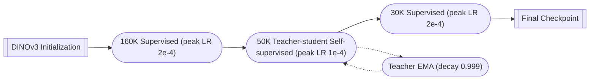
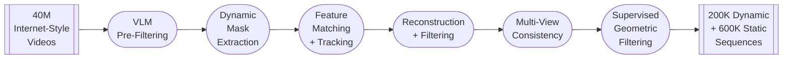
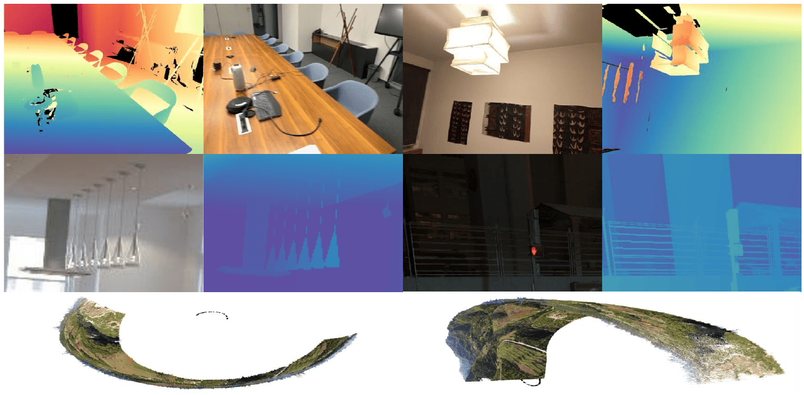

# VGGT-Omega: Detailed training pipeline report (A3)

## Training Curriculum

VGGT-Omega alternates supervised and self-supervised training across three stages.

Figure 14. Three-stage training schedule with self-supervised teacher loop.

**Backbone and freezing.** The DINOv3-initialized backbone stays unfrozen throughout. The supervised stages train all heads; the self-supervised stage freezes the camera and depth heads to prevent collapse.

**Normalization.** Normalization applies to the ground truth, not the predictions. All quantities are mapped into the first camera's frame, then depths and translations are scaled by the mean distance of the 3D points to the origin. Attention layers use QKNorm, and gradients are clipped to norm $1.0$.

**Supervised losses.** The supervised stages optimize a weighted sum of four terms,
$$\mathcal{L} = 5.0\,\mathcal{L}_\text{cam} + 1.0\,\mathcal{L}_\text{depth} + 0.5\,\mathcal{L}_\text{point} + 0.1\,\mathcal{L}_\text{match}.$$
The camera term is an $\ell_1$ loss on the 9-dimensional camera vector $\mathbf{g}_i = (\mathbf{q}_i, \mathbf{t}_i, \mathbf{f}_i)$ of rotation quaternion, translation, and field of view,
$$\mathcal{L}_\text{cam} = \sum_{i=1}^{N} \left| \hat{\mathbf{g}}_i - \mathbf{g}_i \right|.$$
The depth term weights the residual $e_i = \hat{D}_i - D_i$ by the predicted confidence $c_i^D$ and a relative-scale factor, adds a gradient-consistency term, and regularizes the confidence,
$$\mathcal{L}_\text{depth} = \sum_{i=1}^{N} \left[ \left\| c_i^D \odot (1 + D_i^{-1}) \odot e_i \right\| + \left\| c_i^D \odot \nabla e_i \right\| - \alpha \log c_i^D \right].$$
The point term reuses $\mathcal{L}_\text{depth}$ with the residual $e_i = \pi^{-1}(\hat{D}_i, \hat{\mathbf{g}}_i) - P_i$, where $\pi^{-1}$ unprojects the predicted depth and camera and $P_i$ is the ground-truth point map.

The matching term is a binary cross-entropy on the cosine similarity $s$ between $\ell_2$-normalized last-layer token pairs,
$$\mathcal{L}_\text{match} = \mathbb{E}_\text{pos}\!\left[-\log \sigma(s)\right] + \mathbb{E}_\text{neg}\!\left[-\log(1 - \sigma(s))\right].$$

**Self-supervised stage.** A teacher and a student both start from the supervised checkpoint and process the same frames under independent random augmentations: color jitter, blur, $90^\circ$ rotation, patch masking, and frame reordering. Once both streams are restored to a common frame order, the student matches the teacher through an $\ell_2$ feature-matching loss across layers, together with camera and depth regression. The teacher is an exponential moving average of the student.

## Training Data

**Scale and mixture.** Training draws on roughly 4M scenes and sequences, about 15 times the corpus of [VGGT](#ref-vggt). Each epoch samples roughly 80% synthetic and 20% real data, rising to 90% synthetic when annotations are clean.

**Sources.** The public datasets are Aria series, Bedlam, BEHAVIOR-1K, Co3Dv2, uCo3D, DL3DV, Dynamic Replica, EDEN, EFM3D, HOT3D, Habitat, Hypersim, Mapfree, Mapillary Metropolis, MPSD, Megadepth, Megasynth, Mid-Air, Mvssynth, ParallelDomain-4D, Replica, SAIL-VOS, ScanNet Series, TartanAirV2, TartanGround, Taskonomy, UnrealStereo4K, Virtual KITTI, Waymo, and WildRGBD. Internal data adds artist-created object assets, rigid and dynamic synthetic environments, and real-world device captures. These total about 3M sequences of 10 to 20K images each. Non-synthetic sources are further cleaned of noisy depth and low-coverage sequences.

**Preprocessing.** Temporally ordered datasets sample frames from a local temporal window rather than by covisibility. Each frame is resized to a random aspect ratio in $[0.33, 1.33]$ while keeping the area near $512 \times 512$ pixels, then augmented with color jitter (brightness, contrast, and saturation $0.5$, hue $0.1$), grayscale conversion, and rectangular patch masking that spans $32$ to $128$ pixels per side with probability $0.05$, zeroing the masked pixels and marking their depths invalid.

**Annotation pipeline.** The annotation pipeline labels off-the-shelf videos with camera and depth for static and dynamic scenes.

Figure 15. Video annotation pipeline.

**VLM filtering.** The VLM prompt sorts clips into hard reject, soft reject, and pass at roughly a 50/40/10 ratio, and the passing pool also seeds self-supervised training.

**Camera and depth recovery.** Camera and depth come from Grounding DINO masks over movable regions, a matching ensemble of SIFT, SuperPoint with SuperGlue, ALIKED with LightGlue, and the VGGSfM Tracker, [VGGT](#ref-vggt) camera initialization when RANSAC inliers are scarce, COLMAP bundle adjustment, and patch-based multi-view stereo.

**Quality gate.** A conservative gate ensembles XGBoost, Random Forest, and CatBoost, trained on 500 static and 500 dynamic hand-annotated sequences, over trajectory smoothness, parallax angle, point-cloud PCA shape, depth completeness, and outlier ratio. It drops any sequence whose registration ratio falls below 99.5%, whose field of view leaves $[30^\circ, 120^\circ]$, whose distortion ratio exceeds 0.1, or that keeps fewer than 5% valid-depth pixels.

**Data quality.** Noisy annotations leave specific fingerprints at inference time, so the pipeline is tuned to discard them rather than to maximize yield.

Figure 16. Three annotation failure modes from sensor capture, synthetic thin structures, and bundle adjustment.

Beyond the cases above:

- **Fake background.** Synthetic proxy dome or floor depth in Kubric, PointOdyssey, and BEDLAM is inconsistent with scene semantics; Kubric and PointOdyssey are dropped, and BEDLAM is filtered by a maximum-foreground-depth threshold.
- **Humans in walls.** COLMAP-annotated phototourism such as Megadepth folds pedestrian boundaries into nearby architecture; Megadepth is excluded or its depth re-estimated.
- **Window ambiguity.** Synthetic indoor sets such as Aria Synthetic Environments and HyperSim render outdoor textures on windows, so ground-truth depth lands on the window plane.

**Inherited settings.** Per-dataset sampling weights, the remaining augmentation probabilities, coordinate-convention unification across OpenCV, NED, and OpenGL sources, and depth-clipping rules follow [VGGT](#ref-vggt).

## Training Config

- **Optimizer.** AdamW over 240K iterations.
- **Learning rate.** Linear warmup over the first 5% of iterations, then cosine decay over the remaining 95%.
- **Batch and hardware.** 128 H100 96GB GPUs, with the per-batch frame count drawn uniformly from $[1, 24]$ and the batch size scaled to saturate GPU memory.
- **Precision.** bfloat16 mixed precision with FSDP.
- **Inherited settings.** AdamW betas and weight decay, dataloader and checkpoint-saving settings, and the random-seed protocol follow [VGGT](#ref-vggt).

## References

**[VGGT-Omega.](https://alphaxiv.org/abs/2605.15195)**
Jianyuan Wang, Minghao Chen, Shangzhan Zhang, Nikita Karaev, Johannes Schönberger, Patrick Labatut, Piotr Bojanowski, David Novotny, Andrea Vedaldi, Christian Rupprecht.
arXiv:2605.15195, 2026.

**[VGGT: Visual Geometry Grounded Transformer.](https://alphaxiv.org/abs/2503.11651)**
Jianyuan Wang, Minghao Chen, Nikita Karaev, Andrea Vedaldi, Christian Rupprecht, David Novotny.
arXiv:2503.11651, 2025.
